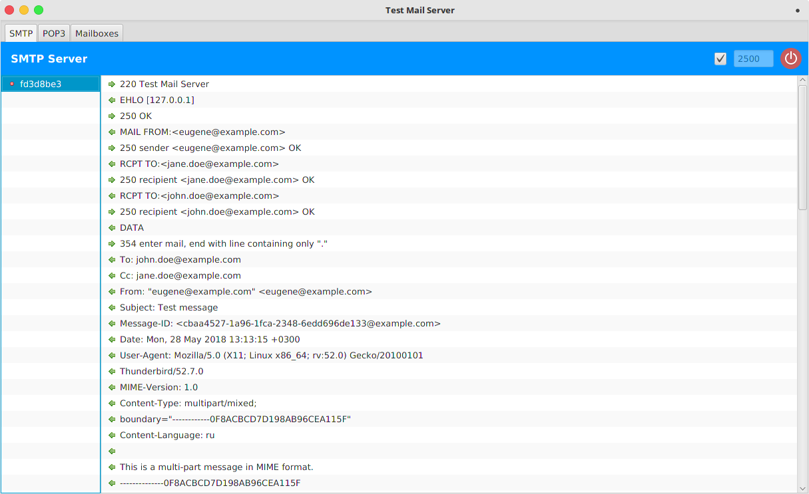
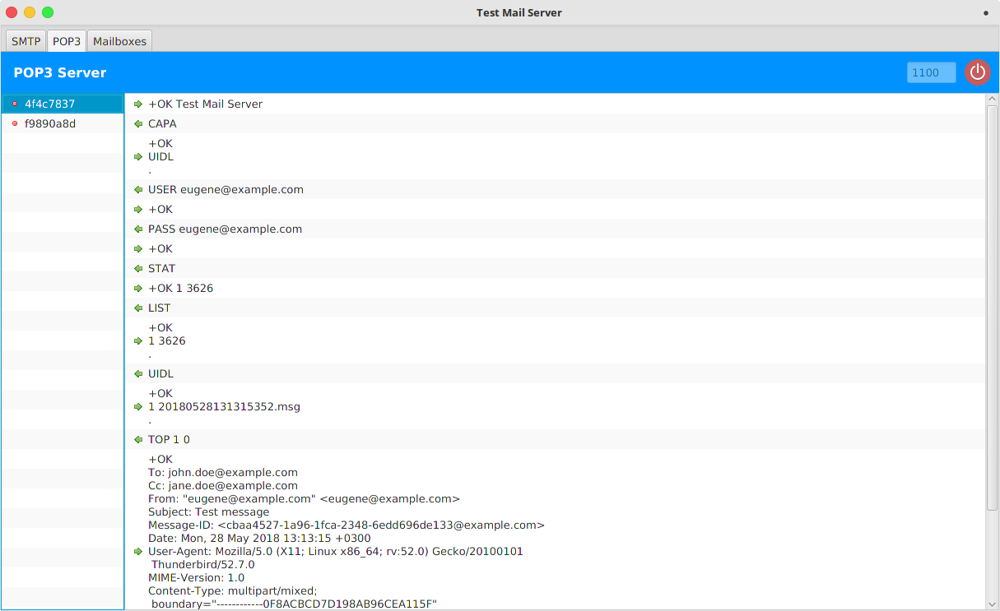
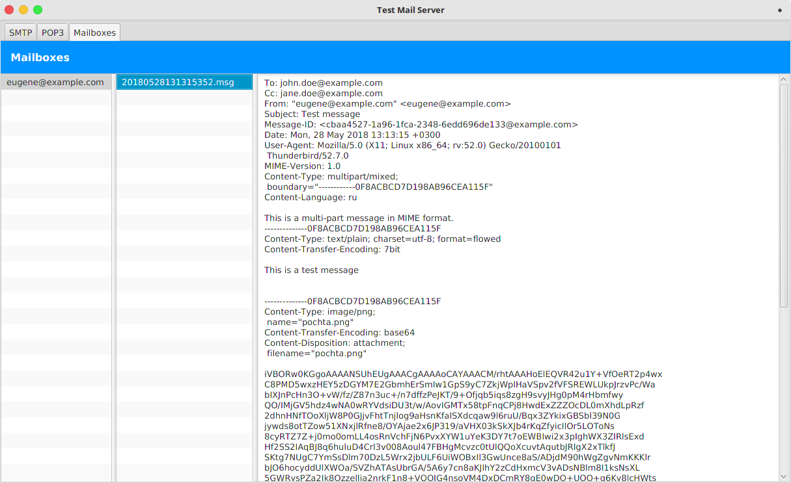

# test-mail-server

A SMTP/POP3 server for testing purposes purely written on Java&trade; with the [Netty](https://netty.io) framework. 


### Requirements

You need a Java 8 or newer installed on your machine.


### Usage

The **test-mail-server-&lt;version&gt;.jar** is auto-executable.
If your desktop environment supports it, you can directly double click on the .jar. 
Otherwise, run the following command with the next command-line arguments.

```
java -jar test-mail-server-<version>.jar <args>
```

### Command-line arguments

Argument                              | Description
--------------------------------------|------------
-h, --help                            | Show help
-s, --smtp-port **&lt;port&gt;**      | Start the SMTP server on the given port
-sr, --smtp-redirect                  | Redirect all incoming messages to the sender's mailbox
-p, --pop3-port **&lt;port&gt;**      | Start the POP3 server on the given port
-m, --mail-dir **&lt;directory&gt;**  | Path to directory to store user's mailboxes and mail messages
-c, --console                         | Start the application in the console mode. No GUI. Can be used to start the application as a *nix daemon or a Windows Service
        

### SMTP server tab


Shows a list of SMTP transactions and its details.


### POP3 server tab


Shows a list of POP3 transactions and its details.


### Mailboxes tab


Shows a list of user's mailboxes, messages in mailboxes and message's bodies.


### Erlang version

An [Erlang&trade;-based version](https://github.com/eugenehr/testmailsrv) is also available.

### Licensing mumbo-jumbo

This software is licensed under the [Apache License, Version 2.0](http://www.apache.org/licenses/LICENSE-2.0).